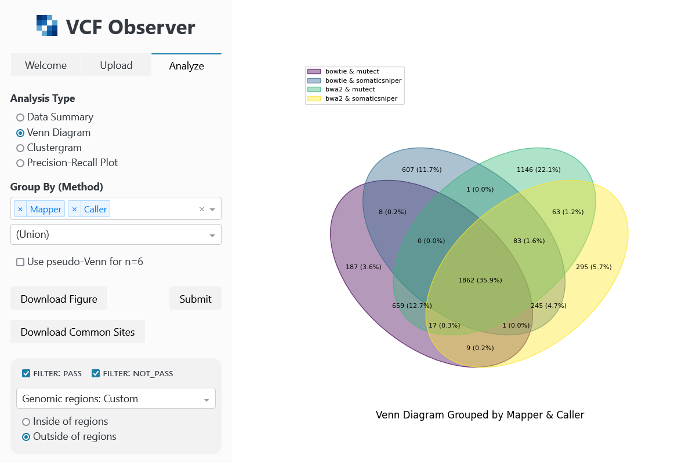

# VCF Observer

VCF Observer is a web tool that performs [VCF](https://en.wikipedia.org/wiki/Variant_Call_Format) file analysis, comparison, and visualization.

## Installation
`git clone` the repository and `cd` into the directory where it was downloaded.

After (optionally) [creating a virtual environment and activating it](https://docs.python.org/3/tutorial/venv.html#creating-virtual-environments), install the project's dependencies by running `pip install -r requirements.txt`.

Once the dependencies have been installed, run the following commands to start the tool:
1. `cd app`
2. `python app.py`

You can then access VCF Observer by clicking the following link:  
[http://127.0.0.1:8050](http://127.0.0.1:8050)
